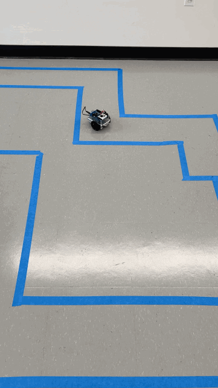

# BOE Shield Bot

I used Parallax Inc. BOE Shield Bot Kit to build the BOE Shield Bot which uses an Arduino Uno as its brain. 

I was then tasked to use what I had learned to create a sketch that will guide the BOE Shield bot through the maze pictured below. 

The GIF below shows a short demonstration.

